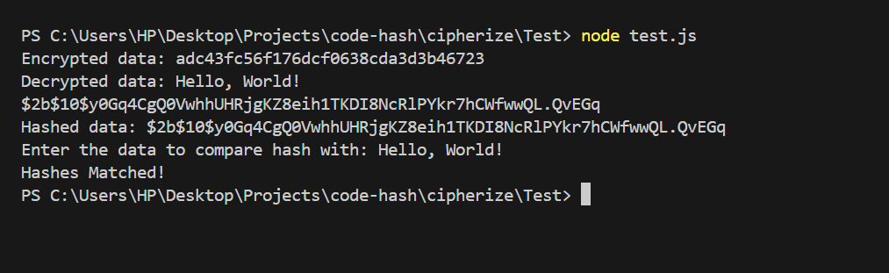

**cipherize**
cipherize is a Node.js package for simplify encryption, decryption and hashing using bcrypt and crypto.

**Installation**
You can install cipherize via npm:

**bash**
npm install cipherize

**Usage**
Encryption,Decryption,Hashing and Compare

const cipherize = require('cipherize');

// Encrypt data using a secret key
const encryptedData = cipherize.encryptData('hello world', 'your-secret-key');
console.log('Encrypted Data:', encryptedData);
Decryption

const cipherize = require('cipherize');

// Decrypt data using a secret key
const decryptedData = cipherize.decryptData(encryptedData, 'your-secret-key');
console.log('Decrypted Data:', decryptedData);
Hashing

const cipherize = require('cipherize');

// Hash data using bcrypt
const hashedData = cipherize.hashData('password');
console.log('Hashed Data:', hashedData);
Compare Hash

const cipherize = require('cipherize');

// Compare a value with a hashed value
const value = 'password';
const hashedValue = '$2b$10$examplehashedvalue';
const isMatch = cipherize.compareHash(value, hashedValue);
console.log('Is Match:', isMatch);
Rehash

const cipherize = require('cipherize');

// Rehash a hashed value
const rehashedValue = cipherize.rehash('password');
console.log('Rehashed Value:', rehashedValue);

Test output

Author
manikandan0508

License
This project is licensed under the MIT License - see the LICENSE file for details.
